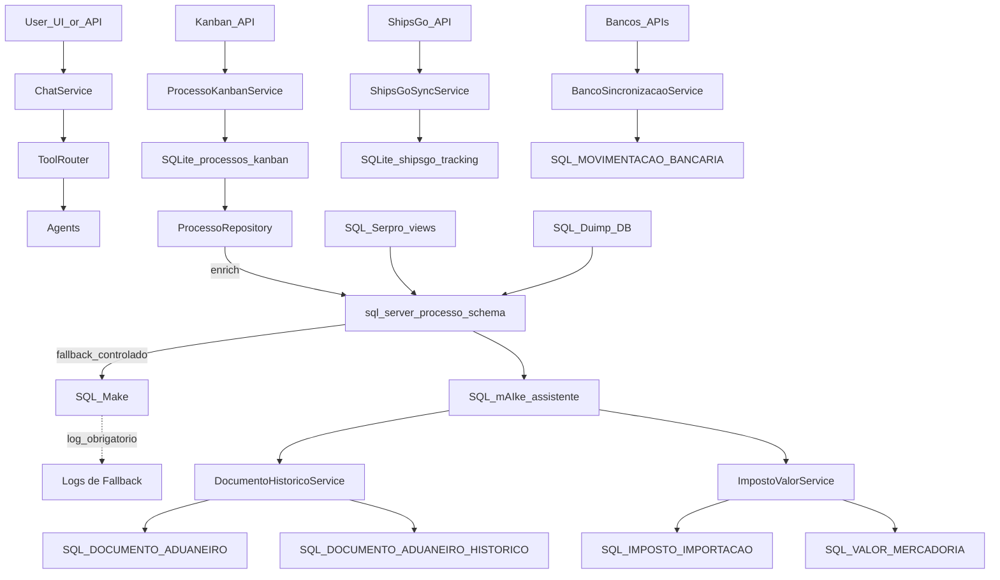

# 📊 Fontes de Dados e Fluxo do Sistema

**Data:** 22/01/2026  
**Status:** ✅ Documentação de Auditoria

---

## 🎯 Objetivo

Garantir que o sistema siga um fluxo claro e previsível de dados:

- **Prioridade de leitura**: SQLite (snapshot Kanban + ShipsGo) para velocidade operacional
- **Enriquecimento e persistência**: SQL Server `mAIke_assistente` para histórico/valores/impostos/documentos
- **Legado**: `Make` só como fallback controlado (auto-heal/migração) com logs explícitos

---

## 📋 Fontes de Dados por Domínio

### 1. **Processos de Importação**

#### SQLite (`processos_kanban`)
- **Fonte**: API Kanban (`http://172.16.10.211:5000/api/kanban/pedidos`)
- **Sincronização**: Automática a cada 5 minutos
- **Campos principais**:
  - `numero_processo`, `categoria`, `status_atual`
  - `numero_ce`, `situacao_ce`, `data_desembaraco`
  - `numero_di`, `situacao_di`, `canal`
  - `numero_duimp`, `situacao_duimp`
  - `eta_iso`, `porto_codigo`, `porto_nome`
  - `dados_completos_json` (snapshot completo do Kanban)
- **Uso**: Cache rápido para consultas operacionais (status, ETA, canal)
- **Responsável**: `services/processo_kanban_service.py` → `services/processos_kanban_repository.py`

#### SQL Server `mAIke_assistente` (`PROCESSO_IMPORTACAO`)
- **Fonte**: Consolidação de múltiplas fontes (Kanban, SQL Server legado, APIs)
- **Campos principais**:
  - Dados consolidados do processo
  - Histórico de mudanças (`TIMELINE_PROCESSO`)
  - Valores e impostos (`VALOR_MERCADORIA`, `IMPOSTO_IMPORTACAO`)
- **Uso**: Fonte durável para histórico, relatórios, valores financeiros
- **Responsável**: `services/sql_server_processo_schema.py` → `services/processo_repository.py`

#### SQL Server `Make` (Legado) ⚠️
- **Fonte**: Banco legado (migração em andamento)
- **Uso**: **Apenas fallback controlado** para processos antigos/arquivados
- **Quando usar**: Auto-heal quando processo não existe no `mAIke_assistente`
- **Log obrigatório**: Sempre que usar `Make`, logar explicitamente
- **Responsável**: `services/sql_server_processo_schema.py` (com política central)

---

### 2. **Tracking de Navios (ShipsGo)**

#### SQLite (`shipsgo_tracking`)
- **Fonte**: API ShipsGo
- **Sincronização**: Automática
- **Campos principais**: ETA, eventos de tracking, portos
- **Uso**: Cache para consultas de ETA e tracking
- **Responsável**: `services/shipsgo_sync_service.py`

---

### 3. **Documentos Aduaneiros (CE, DI, DUIMP, CCT)**

#### SQLite (Cache)
- **Fonte**: Kanban JSON + SQL Server
- **Tabelas**: `processo_documentos` (cache de documentos)
- **Uso**: Cache rápido para consultas frequentes
- **Responsável**: `db_manager.py` → `services/ce_documento_handler.py`, `services/di_documento_handler.py`, etc.

#### SQL Server `mAIke_assistente` (`DOCUMENTO_ADUANEIRO`)
- **Fonte**: Consolidação de múltiplas fontes
- **Campos principais**: Dados completos de CE/DI/DUIMP/CCT
- **Histórico**: `DOCUMENTO_ADUANEIRO_HISTORICO` (mudanças de status)
- **Uso**: Fonte durável para histórico e consultas documentais
- **Responsável**: `services/documento_historico_service.py`

#### SQL Server `Serpro` (Views)
- **Fonte**: Views do banco Serpro
- **Tabelas**: `Serpro.dbo.Hi_Historico_Di`, `Serpro.dbo.Di_Root_Declaracao_Importacao`
- **Uso**: Enriquecimento de dados de DI (valores, impostos, histórico)
- **Responsável**: `services/sql_server_processo_schema.py`

#### SQL Server `Duimp` (Database)
- **Fonte**: Banco Duimp dedicado
- **Tabelas**: `duimp.dbo.duimp`, `duimp.dbo.duimp_tributos_calculados`
- **Uso**: Dados completos de DUIMP (tributos calculados, pagamentos)
- **Responsável**: `services/sql_server_processo_schema.py`

---

### 4. **Movimentações Bancárias**

#### SQL Server `mAIke_assistente` (`MOVIMENTACAO_BANCARIA`)
- **Fonte**: APIs de bancos (Banco do Brasil, Santander)
- **Sincronização**: Manual ou agendada
- **Campos principais**: Lançamentos bancários, descrições, valores, datas
- **Uso**: Conciliação bancária, classificação de despesas
- **Responsável**: `services/banco_sincronizacao_service.py`

---

### 5. **Impostos e Valores**

#### SQL Server `mAIke_assistente` (`IMPOSTO_IMPORTACAO`, `VALOR_MERCADORIA`)
- **Fonte**: DI/DUIMP (Serpro/Duimp DB) + cálculos manuais
- **Campos principais**:
  - `IMPOSTO_IMPORTACAO`: II, IPI, PIS, COFINS, Taxa SISCOMEX
  - `VALOR_MERCADORIA`: FOB, CIF, VMLD, Frete, Seguro (USD/BRL)
- **Uso**: Relatórios financeiros, conciliação, cálculos
- **Responsável**: `services/imposto_valor_service.py`, `services/relatorio_fob_service.py`

---

## 🔄 Fluxo de Dados (Alto Nível)



---

## 📍 Mapeamento de Fontes por Tool/Serviço

### Tools de Processo

| Tool | Fonte Primária | Fonte Secundária | Fallback | Observações |
|------|---------------|-----------------|----------|-------------|
| `obter_dashboard_hoje` | SQLite (`processos_kanban`) | SQL Server `mAIke_assistente` | - | Cache rápido |
| `consultar_status_processo` | SQLite → SQL Server `mAIke_assistente` | SQL Server `Make` | ✅ Com log | Auto-heal se não encontrar |
| `listar_processos_registrados_hoje` | SQLite (`processos_kanban`) | - | - | Query por data |
| `listar_processos_desembaracados_hoje` | SQLite (`processos_kanban`) | - | - | Query por data |
| `sincronizar_processos_ativos_maike` | API Kanban | SQL Server `mAIke_assistente` | - | Sincronização automática |

### Tools de Documentos

| Tool | Fonte Primária | Fonte Secundária | Fallback | Observações |
|------|---------------|-----------------|----------|-------------|
| `consultar_ce` | SQLite cache → SQL Server `mAIke_assistente` | SQL Server `Make` | ✅ Com log | Via `id_importacao` |
| `consultar_di` | SQLite cache → SQL Server `mAIke_assistente` | SQL Server `Make` + Serpro | ✅ Com log | Via `id_importacao` |
| `consultar_duimp` | SQLite cache → SQL Server `mAIke_assistente` | SQL Server `Duimp` DB | - | Via `numero_duimp` |
| `consultar_cct` | SQLite cache → SQL Server `mAIke_assistente` | - | - | Cache rápido |

### Tools de Relatórios

| Tool | Fonte Primária | Fonte Secundária | Fallback | Observações |
|------|---------------|-----------------|----------|-------------|
| `gerar_relatorio_fob` | SQL Server `Make` ⚠️ | SQL Server `mAIke_assistente` | - | **REQUER CORREÇÃO** |
| `gerar_relatorio_averbacoes` | SQL Server `Make` ⚠️ | SQL Server `mAIke_assistente` | - | **REQUER CORREÇÃO** |

---

## ⚠️ Pontos de Uso do Banco Legado `Make`

### Alto Risco (Requer Correção Imediata)

1. **`services/relatorio_fob_service.py`**
   - **Linhas**: 327, 499, 641, 753
   - **Query**: `FROM make.dbo.PROCESSO_IMPORTACAO`
   - **Ação**: Trocar para `mAIke_assistente` com fallback controlado

2. **`services/relatorio_averbacoes_service.py`**
   - **Linha**: 207
   - **Query**: `FROM make.dbo.PROCESSO_IMPORTACAO`
   - **Ação**: Trocar para `mAIke_assistente` com fallback controlado

3. **`services/di_documento_handler.py`**
   - **Linha**: 80
   - **Query**: `FROM Make.dbo.PROCESSO_IMPORTACAO`
   - **Ação**: Usar política central de DB

### Médio Risco (Fallback Controlado com Log)

4. **`services/sql_server_processo_schema.py`**
   - **Linha**: 88 (default `'Make'`)
   - **Linha**: 171 (parâmetro default `'Make'`)
   - **Ação**: Remover defaults, usar política central

5. **`services/processo_repository.py`**
   - **Linha**: 480 (fallback explícito para `Make`)
   - **Status**: ✅ Já tem log explícito
   - **Ação**: Usar política central para consistência

6. **`services/processo_snapshot_service.py`**
   - **Linha**: 111 (fallback explícito para `Make`)
   - **Ação**: Usar política central

### Baixo Risco (Comentários/Referências)

7. **`services/agents/processo_agent.py`**
   - **Linha**: 2467 (query direta em `make.dbo.PROCESSO_IMPORTACAO`)
   - **Ação**: Verificar se ainda é necessário, usar política central

---

## 🔍 Camadas: Cache vs Fonte Durável

### Cache (SQLite)
- **Propósito**: Velocidade operacional
- **Tempo de vida**: Atualizado a cada 5 minutos (Kanban) ou on-demand
- **Quando usar**: Consultas rápidas de status, ETA, canal
- **Limitações**: Pode estar desatualizado (até 5 minutos)

### Fonte Durável (SQL Server `mAIke_assistente`)
- **Propósito**: Histórico, valores, impostos, documentos
- **Tempo de vida**: Persistente
- **Quando usar**: Relatórios, cálculos financeiros, histórico completo
- **Vantagens**: Dados consolidados, histórico completo

### Fallback (SQL Server `Make`)
- **Propósito**: Migração/auto-heal de processos antigos
- **Quando usar**: Apenas quando processo não existe no `mAIke_assistente`
- **Requisitos**: **SEMPRE** logar explicitamente quando usar
- **Futuro**: Será descontinuado após migração completa

---

## 📊 Monitoramento de Fallback

### Logs de Fallback para `Make`

Quando ocorrer fallback para `Make`, o sistema deve logar:

```
⚠️ [FALLBACK_MAKE] Processo {processo_referencia} não encontrado no mAIke_assistente
   → Consultando banco legado (Make) para migração/auto-heal
   → Tool/Serviço: {tool_name}
   → Chamador: {caller_function}
   → Timestamp: {timestamp}
```

### Endpoint de Observabilidade (Futuro)

Planejado: `/api/internal/sources-used` para rastrear fontes usadas na última resposta.

---

## ✅ Checklist de Validação

- [ ] Nenhum hardcode de `Make` sem política central
- [ ] Todos os fallbacks para `Make` têm log explícito
- [ ] Relatórios críticos (FOB, Averbações) usam `mAIke_assistente` como primário
- [ ] Política central de DB implementada e testada
- [ ] Documentação atualizada com fontes por domínio

---

**Última atualização**: 22/01/2026
